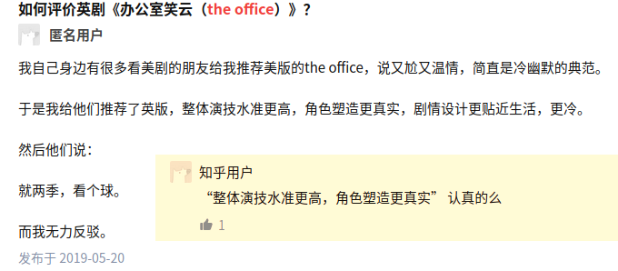

一个简单的例子告诉你大众也就是大众:
------------
### 偶然看到知乎上关于the office美版的讨论,遂也搜索了一下我爱看的英版the office.\n
### 整个知乎貌似就这么点讨论,居然评论里还有'骂'的,还被唯一的赞了,这骂的风格真是dejav啊.

[]

### 在豆瓣上the office 美版评分比英版高,而且不只是豆瓣,IMDB也是.
### 然而Youtube上关于The office的视频下方评论基本都认同UK明显更好.

# Marked

- ⚡ built for speed
- ⬇️ low-level compiler for parsing markdown without caching or blocking for long periods of time
- ⚖️ light-weight while implementing all markdown features from the supported flavors & specifications
- 🌐 works in a browser, on a server, or from a command line interface (CLI)

## Demo

Checkout the [demo page](https://marked.js.org/demo/) to see marked in action ⛹️

## Docs

Our [documentation pages](https://marked.js.org) are also rendered using marked 💯

Also read about:

* [Options](https://marked.js.org/#/USING_ADVANCED.md)
* [Extensibility](https://marked.js.org/#/USING_PRO.md)

## Installation